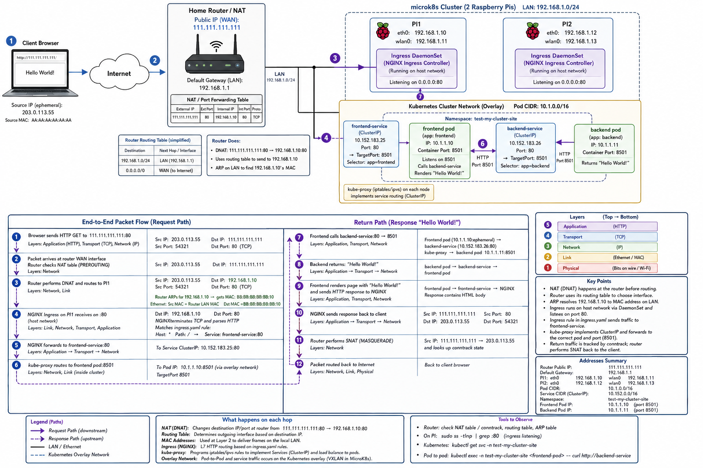

# Table of Contents

- [Intro](#intro)
- [File_Structure](#file_structure)
- [Definitions](#definitions)
- [Local_Development](#local_development)
- [Deployment](#deployment)
- [Networking](#networking)


# Intro

The purpose of this project is to use raspberry pis to demonstrate the basic principles of networking and cloud computing.  To that end, the actual application is very basic.  It's sole function is to illustrate key concepts and I keep it simple so the details of application programming do not interfere with the cloud and networking elements.  References to layers are to the layers used on the Internet and not the 7 layer theoretical model from the Open Systems Interconnection (OSI) model. The layers are:

Layer 5: Application Layer (Data)
Layer 4: Transport Layer ("Segment" over TCP / "Datagram" over UDP)
Layer 3: Networking Layer ("packets")
Layer 2: Link Layer ("frames" over ethernet or wireless "links" identified with MAC addresses resolved by ARP)
Layer 1: Physical layer ("bits" over copper wire/wireless) 

So if I refer to Link layer you know what I mean. 

# File_Structure

The file structure is set up as a single workspace with two build units each consisting of one package. 

------------------------
microk8s
│   argo-cd.yaml
│   backend.yaml
│   frontend.yaml
│   ingress.yaml
│   namespace.yaml
src
├───backend
│   │   Dockerfile
│   │   pyproject.toml
│   │   
│   └───app
│          main.py
│          __init__.py
│               
└───frontend
    │   Dockerfile
    │   pyproject.toml
    │   
    └───app
            main.py
            __init__.py
tests
docker-compos.yaml
pyproject.toml
README.md
-------------------------

# Definitions

ARP
: Address Resolution Protocol

CD
: Continuous Deployment
: The process by which the current version of your code is instantly deployed after being changed

CI
: Continuous Integration
: The process by which you collaboratively make changes to code and push them to a version control system like Github

DHCP
: Dynamic Host Control Protocol
: Randomly assigns new IP addresses to devices on a local network

k8s Object
: Just like in object oriented programming, this refers to a specific instance of a Resource Type, so whereas the term Pod is a resource type, a pod living within a given namespace with a specific id number is considered an Object

k8s Resource Type:
: This refers to the type of thing k8s creates, like a Node is a Type, a Pod is a Type, a Service is a Type

LAN
: Local Area Network

MAC
: Media Access Control : creates unique address for hardware

WAN
: Wide Area Network

# Local_Development

## Local_Development_No_Docker

### Step Zero: 

You should have an integrated development environment (IDE) within which you can code like PyCharm or VS Code or whatever suits your needs.  Once you have that, you need to get this code on your laptop.  Given that this tutorial involves a CI/CD process that you will need to perform in your own github account and your own raspberry pis, you should:

(i)  Fork (not clone) this repo
(ii) Clone the Forked version of this repo onto your laptop

### Step One: Ensure you have installed uv

#### Windows

```powershell -ExecutionPolicy ByPass -c "irm https://astral.sh/uv/install.ps1 | iex"```

#### Linux

```curl -LsSf https://astral.sh/uv/install.sh | sh```

### Step Two: Create venv

```uv venv```

### Step Three: Activate venv

#### Windows (if using powershell)

```.\.venv\Scripts\Activate.ps1```

#### Linux

```source .venv/bin/activate```

### Step Four: Install Packages

```uv sync```

### Step Five: Run Backend and Frontend -- No Docker

There are two (2) different ways of running this simple application locally.  The first is to run the FastAPI backend and the streamlit frontend directly on your computer without any intermediation by Docker containers.  That is what this step illustrates.  The other approach is shown below in a different step five.

#### Backend

In a new terminal within your IDE (but inside your test-my-cluster-site project root) run:

```uv run --package backend uvicorn src.backend.app.main:app --reload```

Once this runs, you can go to the localost website port 127.0.0.1:8000 and you should see "Hello World" displayed or, alternatively, you can go to http://127.0.0.1:8000/docs and see the "swagger ui" that comes automatically with the FastAPI library you downloaded when you ran the uv installation above. 

#### Frontend

You must leave that uvicorn FastAPI() terminal running and open a second terminal to run the frontend.  To run the frontend, use this command from the project root:

```uv run --package frontend streamlit run src/frontend/app/main.py```

You can see the app in your browser by going to localhost:8501.

***comment:*** If you run backend and frontend this way, the way frontend "knows" where to contact backend is via this line of code in src.app.frontend.main:

```BACKEND_URL = os.getenv("BACKEND_URL", "http://localhost:8000")``

Given that there is no environment variable set with the value of BACKEND_URL, the url defaults to localhost:8000 which is what we want because the FastAPI is listening on that exact port. Importantly, our app is not available on our Local Area Network much less the Internet.  The only place you can access it is via the computer that happens to be running the backend package. 

## Local_Development_Docker

When we move to our 'cloud', each "build unit" (your backend and frontend) will run within its own "container" within a "pod" which is spawned by and associated with a "Node".  We'll get to that in more detail in the lessons.  Long story short, though, to run the build units on a container on your laptop, we need Docker.  So, you must install Docker on your laptop, the Community Edition is fine. 

### Step Five: Run Backend and Frontend -- Docker

You must start the docker daemon (you can typically just click on the Docker Desktop icon and wait for it to load) before running these commands:

```docker compose up``` 

OR

```docker compose up --build --force-recreate``` if you change the image

# Deployment

Thus far, we have a very simple web application.  It is not running in a cloud environment.  It is not accessible on our home local area network (LAN).  It definitely is not accessible via the Internet.   

## Preparing_the_Pis

We are going to use two (2) Raspberry Pis as two different servers to create a small "cloud" infrastructure.  I used two Rastech Raspberry Pis with 64 bit ARM Cortex A76 processors with the Ubuntu server distro of Linux installed with the Ubuntu distro.  You can try other setups but various files would have to be changed in the tutorial.  I also suggest that if you are connecting to your home network via ethernet you get an ethernet switch so that you can plug both Raspberry Pis + your laptop into the switch at the same time and plug the switch into your ethernet jack.  I am assuming you have read the instructions to set up the Pis and you have two running Pis connected to your local area network.  You need to mentally choose one to be your "Master" and the other as "Worker".  Keep them separate and identify them (by hostname or by a sticky or whatever works for you).  We'll formalize this distinction in a moment. You need to have two Pis with the Ubuntu server (not client) version of Linux installed before proceeding. 

### Assign Static IP Addresses to Each Pi

Absent some instruction to the contrary, your router will randomly assign new ip addresses to your Pis every time they restart using the Dynamic Host Control Protocol (DHCP).  To avoid that frustration, we need to assign static IP addresses to each Pi.  The trick here though is that we want to choose addresses that fall INSIDE of your home LAN's range but OUTSIDE of the range of addresses used by DHCP otherwise you will may have conflicts.  Alternatively, you can get on your ISP's website and log in and "reserve" IP addresses on your router (kind of like an Amazon firestick does when you plug it in).

Most home networks use something like:

Router / default gateway: 192.168.1.1
Subnet mask: 255.255.255.0

That usually means your usable LAN range is:

192.168.1.1 → router
192.168.1.2 - 192.168.1.254 → usable device addresses
192.168.1.255 → broadcast address (not usable)

The DHCP is harder to determine.  You can get some information by checking on the Pi or your laptop (windows) ```ipconfig``` or (linux) ```ifconfig```.  When in doubt, check your ISP's website. For purposes of this project, I am going to assume we chose the following IP addresses for each device and link:

|Pi Name|Link Layer|Static Address|
|-------|----------|--------------|
|Master|eth0|192.168.1.10|
|Master|wlan0|192.168.1.11|
|Servant|eth0|192.168.1.12|
|Servant|wlan0|192.168.1.13|

To achieve this result we need to take a number of steps on each Pi.  Assuming you have Ubuntu server installed, there are a couple of key components that we will be working with:

- systemd (the system that manages the operating system)
- systemd-networkd (used for networking)
- netplan (this reads yamls and configures systemd from those yamls)

We need to enable systemd-networkd on **Master**:

```sudo systemctl enable systemd-networkd```

We need to start systemd-networkd on **Master**:

```sudo systemctl start systemd-networkd```

To perform the next steps, you will need to navigate to the root (/) of Ubuntu on Master and find the cloud-init.yaml in your /etc/netplan/ folder on Master.  You need to amend it (using a text editor, ```sudo vi <insert file name>``` or ```sudo nano <insert file name>```) to look like this:

network:
  version: 2
  renderer: networkd

  ethernets:
    eth0:
      dhcp4: false
      addresses:
        - 192.168.1.10/24
      routes:
        - to: 0.0.0.0/0
          via: 192.168.1.1
          metric: 200
      nameservers:
        addresses:
          - 1.1.1.1
          - 8.8.8.8
  wifis:
    wlan0:
      dhcp4: false
      addresses:
        - 192.168.1.11/24
      access-points:
        <YOUR_WIFI_SSID>:
          password: <YOUR_WIFI_PASSWORD>
      routes:
        - to: 0.0.0.0/0
          via: 192.168.1.1
          metric: 100
      nameservers:
        addresses:
          - 1.1.1.1
          - 8.8.8.8

This assumes your default gateway is 192.168.1.1 (you need to check).  It also assumes you chose the same static IP address that I did.  It further assumes you have the Pi connected via ethernet AND wifi.  If you don't use wifi you can delete wifis: and everything below it.  If you don't have ethernet, you can delete the section associated with ethernets. The reference to nameservers are DNS servers provisioned by Cloudflare (1.1.1.1) and Google (8.8.8.8) which are used to resolve domain names (i.e., www.google.com) into actual IPv4 or IPv6 addresses.  We'll dive into that more once we expose our Hello World! app to the wider internet. 

```sudo netplan generate``` # Should surface any major issues, if errors arise debug
```sudo netplan apply``` # Should apply the yaml and configure systemd-networkd

Now check the status of each of the Link layers attached to your Master.  You should hopefully see the specific static IP addresses applied to each link within each device. 

```networkctl status eth0```
```networkctl status wlan0```

Once you have confirmed that you have a static IP address on your LAN for whichever Pi you choose to be your **Master**, repeat the same process on your **Servant/Worker** (but change the static IP addresses to 192.168.1.12 for ethernet and 192.168.1.13 for wlan0).

### Installing Microk8s

A deep dive on container orchestration is beyond the scope of this tutorial.  For our purposes, it suffices to say that we have an app with two (2) build units: backend and frontend.  On our server, these will run in containers.  The way we coordinate these containers is with a container orchestration platform, the most common of which is kubernetes (k8s).  k8s requires a lot of configuration, and so for this project, we will use microk8s, which is essentially the same as k8s but requires less manual configuration and uses all the same kubectl commands as k8s. I will refer to k8s as a general matter, but when you see commands you will see microk8s referred to.  A k8s cluster consists of at least three components: (i) Node; (ii) Pod; and (iii) Container.  You should only have one Node per Host.  For this purpose, a Host could be a physical machine (like our Raspberry Pis) or you could have a much larger compute resource (like a large server) that you break into multiple hosts using a "virtualization layer".  You can technically operate k8s with just one (1) Node, but given that does not really illustrate the power of cloud computing, we will use two Nodes, one on each Pi.  One Node on one Pi (Master) must own and operate the "control plane".  The control plane is what ultimately has control of what gets spun up and down etc.  That is why you must choose a Master Pi.  

At the risk of overloading you with information, there are lots of other Object types in K8s, but I will only list the ones relevant to this project:

Core Workload Objects:
  Pod (mentioned above)
  Deployment
  ReplicaSet
  DaemonSet

Networking Objects:
  Service
  Ingress
  NetworkPolicy

Configuration Objects:
  configmap
  secret

Storage Objects:
  Persistent Volume
  Persistent Volume Claim

#### Install microk8s on our **Master**:

```sudo apt update``
```sudo snap install microk8s --classic```

Hopefully this occurred without a hitch.  If not, you need to debug.  Now check the status:

```sudo microk8s status```

The status command gives you an overview of what features are enabled and disabled.  Look specifically at:

addons:
  enabled:

To make sure we have what we need, run these commands (its possible some of these are enabled already):

```sudo microk8s enable dns```
```sudo microk8s enable ingress```
```sudo microk8s enable helm3```

Wait for a couple of minutes and then run the status command again and ensure everything is up and running.  

**comment:** There is a key idea here to spend a little time understanding.  "add-ons" are cluster-wide resources.  So anything that shows up here will automatically be available on Servant once we join your Servant Raspberry Pi to the cluster controlled by Master via the Control Plane. 

The above doesn't show you ***how*** those features are enabled (i.e., as pods, svcs, both).  So to see that run: 

```sudo microk8s kubectl get all -n kube-system```

You should now see some pods and svcs.  You should also be able to see that you have your node with the control plane spun up:

```sudo microk8s kubectl get nodes --show-labels```

You should only see one (1) node at this point and the label (which may be long) should refer to "controlplane" somewhere.

#### Install microk8s on our **Servant**:

Run this command on **Master** not **Servant**:

```sudo microk8s add-node```

The output should reveal a token which should look something like this (note its an addr:port/code): 192.168.1.10:234/abcdef1234567890.  You need to use that token on your Servant node.  To pass it over there you have a number of alternatives: (i) use a thumb drive (save it to .txt file and then save on thumb drive); (ii) email it if you have email enabled on your Pis; or (iii) given that both Pis are on your LAN, you can use something called netcat (you will have to look up how to install and pass info I don't address it here).

On your **Servant** not **Master** run:

```sudo microk8s join <replace this with your token>```

Now assuming you didn't receive any errors there, go back to your **Master** and run:

```sudo microk8s kubectl get nodes -A```

You should see two (2) nodes now.  One is hosted by **Master** and one is hosted by **Servent**, but the Master has the control-plane. 

## Continuous Integration

Phew!  Okay, so you now have two nodes running on two bare-metal machines, so technically, you have a "cluster".  Unfortunately, it is not really doing anything useful.  You have no pods with containers running actual build units associated with our application.  

**comment:** make sure that before you proceed you have pushed the most recent version of your application to your github remote repository (see above).

### Install Git on Master

On the **Master** install git:

```sudo apt update```
```sudo apt install git```

Now clone your repo onto **Master**.  You can get the command by going to your remote github repository, clicking the green code button, and seeing the command there.  The method you choose depends on whether you want to use HTTPs (with PAT Token) or SSH with an SSH key.  You need to research that and complete this step on your own.  Whatever method you choose, note "where" in your Ubuntu file system the test-my-cluster-site repo gets cloned into.  Typically you would be in your user home directory (denoted ~).  

Now, **don't** do this, but I want to point out that you could, if you wanted, on your **Master**, navigate to the microk8s folder, comment out the argocd yaml and run microk8s apply -f .  This should deploy your app to your pre-existing 2 node cluster.  The issue with this is that we don't want to be in a situation where every time we change the application code on whatever laptop we are using for local development, we have to have someone manually get onto our **Master** and trigger a redeployment.  We want it to be automatic!  So, to make it automatic, we have to get into Continuous Deployment (or the CD in CI/CD).

## Continuous Deployment

To facilitate automated CD operations, we need to accomplish a number of tasks.  Before explaining that we need to focus on what exactly a container is and how are python build units (backend and frontend) are going to be dealt with on each Pi.  To do that, let's compare to a situation where we have two "virtual machines" running on one physical piece of hardware.  The diagram would look like this:

Pi Hardware
│
└── Hypervisor (Virtualization Layer)
    │
    ├── VM 1
    │   ├── Kernel
    │   ├── OS
    │   └── App
    │
    └── VM 2
        ├── Kernel
        ├── OS
        └── App

That is not what we are doing with this project.  If we did, each VM could conceivably be its own node.  In our setup, each piece of bare metal is its own k8s node.  This is our setup (assuming one Pi here for the moment):

Pi Hardware
│
└── Linux Kernel
    │
    ├── Container A
    │   ├── Python
    │   └── Backend
    │
    └── Container B
        ├── Python
        └── Frontend

The way Linux creates/builds these is with a container runtime called containerd.  Containerd is running on your Pis right now (or should be).  You can see it if you run this command on either Pi:

```sudo snap services microk8s```

You should (hopefully) see something named containerd running.  Now containerd can't create a container from source code.  It needs an "image".  So we know we need a resource to build our image and register it in a place that can be accessed by our Pi.  We also need a resource on our Pi to automatically detect whenever there has been a change to that image, and automatically pull that image down to the Pi and trigger a deployment.  The next steps seek to accomplish that.  

### Get Gitops to Build the Image and Register the Image with GHCR

If you forked the test-my-cluster-site repo, then you should see this file: .github\workflows\ci.yaml. Now that is the file that lets github know we want to have github actions build our images.  You can verify that this has been recognized in your repo by clicking on the Actions tab in the horizontal navbar.  When you click on it, you should see something like CI\CD on the left vertical side-panel. If it suggests you need to "Enable Actions" then enable it.  You will notice that the ci.yaml contains two variables denoted by the ${{ }} pattern.  All of these variables are automatically supplied by Github which makes life easy.  

You should confirm that a workflow has run and you see a green checkmark.  If not, click New Workflow and just see if Github Actions can build the images.  If it can't you need to debug at this stage.

Assuming you have a green checkmark, the images (backend and frontend) should now be registered with github's container registry or ghcr.  You can confirm by going back to your <> Code repository tab in the horizontal navbar and looking for the Packages window.  Click into that window and confirm that the you have a frontend package and a backend package there. 

### Install ArgoCD to Pull the Images Down onto Your Kubernetes Cluster

Now, whenever we change the main branch in our repo, this CI pipeline should automatically be triggered and should build a new image of frontend and backend.  But this doesn't get the images onto our k8s cluster.  You may already be familiar with how to perform a git fetch or git pull command to pull a new version of the github repository onto your **Master** pi.  But your local git repository is not what will be transferred into the containers within the pods.  To address that issue, we'll use argo-cd.  It's not the only tool that can be used, but it works with microk8s and it is user friendly. Alternatives include, but are not limited to, Jenkins and Flux.  But the below references argo.

**comment:** argo relies on helm as a dependency which is why we enabled helm early on (see above).

```sudo microk8s kubectl create namespace argocd```
```sudo microk8s kubectl apply -n argocd -f https://raw.githubusercontent.com/argoproj/argo-cd/stable/manifests/install.yaml```
```sudo microk8s kubectl get pods -n argocd```

We create a special namespace because it is a way to isolate k8s objects from one another. 

Navigate to the microk8s folder within your local repo and execute this command manually.  In theory you should only have to do this once - the first time you pull the images down onto your nodes:

```sudo microk8s kubectl apply -f argo-cd.yaml```

Wait like 60 seconds and then run a check to ensure you have one pod spun up called backend and one called frontend.  There is no assurance they will be sitting on the same node.  In fact, they probably won't be, which is part of the point of cloud computing!

```sudo microk8s kubectl get pods -n test-my-cluster-site -o wide```

You should hopefully see something like this:

|NAME|READY|STATUS|RESTARTS|AGE|IP|NODE|
|------------------|--------|---------|------|-----|---|----|
|backend-123456-abc|1/1|Running|0|4d21h|10.1.100.200|master|
|frontend-1234-123|1/1|Running|0|4d21h|10.1.101.220|servant|

Now, if our ngnix ingress controller bound the frontend service to your LAN appropriately, you should, in theory at this point be able to get on any device that is also hooked up to your LAN and then type 1.192.168.1.10 (or .11 or .12 or .13) into your borwser and see Hello World! rendered in your browser.  If not, you need to debug, focus specifically on the daemonset in the ingress namespace.

If you do see the website, congratulations!  We still have not exposed our website to the wider world, but at least its available in your home!

Before we explore how to expose the application on the wider internet, let's pause and take a moment to really dig into how packets move within the LAN.  We address that in the next section. 

# Networking on the LAN

The following explains the the networking aspects of the project.  I start with your home router's external IP address and then drill down to the k8s cluster and the backend and frontend services.  Before proceeding, recall that what we refer to as the "Internet" consists of a five layers:

| **Layer** | **Name**       | **Data Type** |
|-----------|----------------|---------------|
| Layer 5 | Application Layer (hyper-text transfer protocol or http)| Data | 
| Layer 4 | Transport Layer (TCP/UDP) | Segments (for TCP) or Datagrams (for UDP) |
| Layer 3 | Network Layer | Packets or Datagrams |
| Layer 2 | Link Layer | Frames |
| Layer 1 | Physical Layer (Copper Wire, Ethernet, Wireless) | Bits |

## External IP

Bits come into your home via your router and its external IP address.  The connection between your router and your ISP is facilitated by and part of the Wide Area Network (WAN). You can find your WAN information using this command:

### Windows && Linux

```nslookup myip.opendns.com resolver1.opendns.com```

Assume for our purposes that the external IP address is 111.111.111.111.  This address is inside the WAN.  You can You can find your real external address like this:

### Windows

```ipconfig```

### Linux

If you don't have curl, you may have to install it via ```sudo apt install curl```.

```curl -4 ifconfig.me```

## Local Area Network (LAN)

Your LAN creates the network for your home.  The link between the home network and the WAN is the LAN's default gateway.  You can find in windows using ```ipconfig``` and in linux using ```ip route```.  Assume the default gateway is 192.168.1.1.  You can test it by running ```tracert -4 www.google.com```.  The first "hop" should be to the default gateway. The LAN is also part of the Layer 3 Networking Layer.  

### Network Address Translation (NAT)

The network address translation (NAT) protocol changes the destination 
address the of incoming packet from x.x.x.x:80 to, for example, 192.168.1.1:80, port 80 on the default gateway on the LAN.  The NAT works much like a loch between two bodies of water.  The NAT converts an external address on the Wide Area Network (WAN) to an internal address on your Local Area Network (LAN) and back again.   

### Routing Table 

Now that the NAT has translated the destination to be 192.168.1.10, the Routing Table finds the Media Access Control ("MAC") Address of the network card associated with the physical hardware you are trying to reach.  The MAC is a globally unique address (like a GUID) that is associated with the network card on your Pi and the address is independent of what network it is a part of.  The MAC address is discovered by the Routing Table via the Address Resolution Protocol (ARP).  The ARP knows the MAC address because every device connected to the LAN sends out a message saying it is available on the LAN via the ARP, and the router responds asking for the device's MAC address.  

### Getting from the LAN to a Pod on the Cluster


